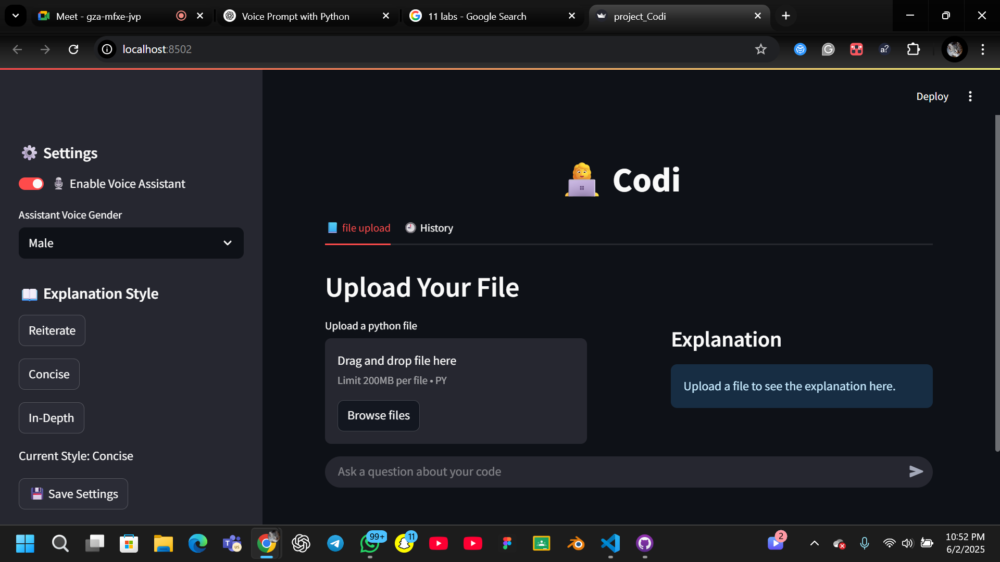
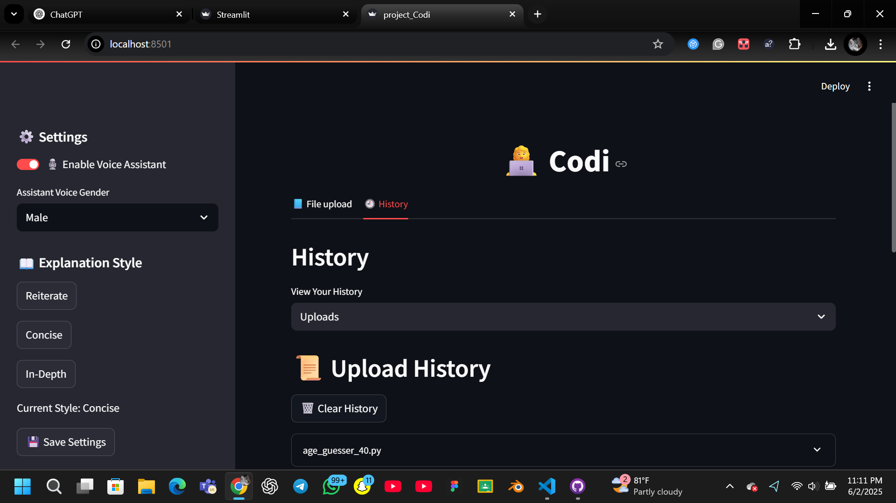

# 👩‍💻 Codi — Your AI-Powered Python Code Explainer

Codi is an AI-powered Python code explainer designed to help developers, students, and educators understand Python code with ease. Upload `.py` files, get intelligent explanations, ask natural-language questions, and download your results as PDFs or MP3 audio — all within a clean Streamlit interface.

---

## 🚀 Features

- 📂 **Upload Python Files**  
  Easily upload `.py` files to analyze and visualize their content.

- 🧠 **Smart Code Explanation**  
  Uses Hugging Face’s **Mixtral** model to provide:

  - Reiterative explanation
  - Concise summary
  - In-depth breakdowns

- 💬 **Ask Questions About Code**  
  Ask natural-language questions about your uploaded code and receive AI-generated answers.

- 🗣️ **Voice Assistant**  
  Let the app read out explanations using realistic text-to-speech, with gender options.

- 📥 **Export Your Insights**  
  Download explanations and chat interactions as:

  - 📄 PDF
  - 🔊 MP3 audio
  - 📝 Text files

- 🕘 **History Tracking**  
  Access history of uploaded files, explanations, and Q&A chats. Revisit or download them anytime.

---

## 🧰 Tech Stack

| Tool                          | Purpose                               |
| ----------------------------- | ------------------------------------- |
| **Streamlit**                 | UI & frontend framework               |
| **Hugging Face Transformers** | LLM-powered code interpretation       |
| **Mixtral (Mistral AI)**      | Smart, multi-expert transformer model |
| **FPDF**                      | PDF generation                        |
| **pyttsx3**                   | Text-to-speech (offline)              |
| **dotenv**                    | API credentials management            |

---

## 📸 Screenshots

### File Upload


### History


---

## 📦 Installation

### 1. Clone the Repository

```bash
git clone https://github.com/your-username/codi.git
cd codi
```

### 2. Create and Activate a Virtual Environment

```bash
python -m venv venv
source venv/bin/activate  # Windows: venv\Scripts\activate
```

### 3. Install Dependencies

```bash
pip install -r requirements.txt
```

### 4. Set Up Environment Variables

```bash
HF_TOKEN=your_huggingface_api_token
```

### 5. Run the App

```bash
streamlit run app.py
```

## 📁 Project Structure

```
codi/
├── codi.env                 # Custom environment config file
├── app.py                  # Main Streamlit application
├── requirements.txt         # Python dependencies
├── README.md                # Project documentation
├── modules/                 # Modular logic
│   ├── audio_bar.py         # Custom audio player for Streamlit
│   ├── explainer.py         # Code explanation logic using HuggingFace API
│   ├── history_manager.py   # Manages upload, explanation, and chat history
│   ├── settings_manager.py  # Load/save user settings (voice, style, etc.)
│   ├── voice_assistant.py   # Text-to-speech logic for voice responses
│   └── data/                # Static and generated resources
│       ├── fonts/
│       │   └── DejaVuSans.ttf   # Font for multilingual PDF generation
│       ├── audio/
│       │   └── *.mp3            # Generated voice responses
│       ├── chat_history.json
│       ├── explanation_history.json
│       ├── settings.json
│       ├── upload_history.json
│       └── *.pdf                # Generated explanation/chat PDFs
```
